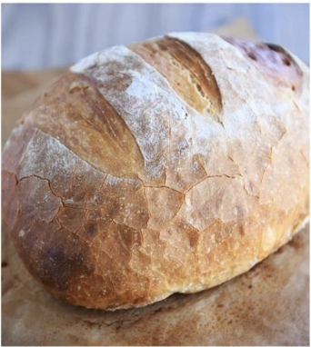
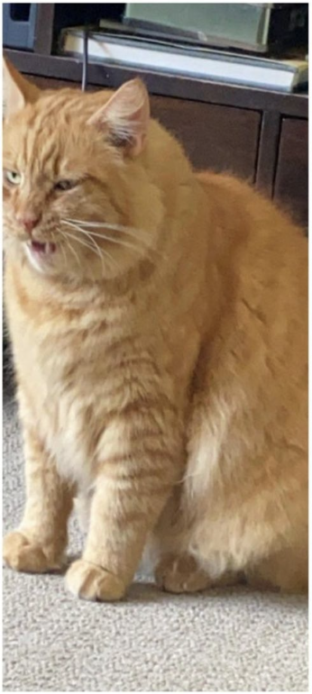
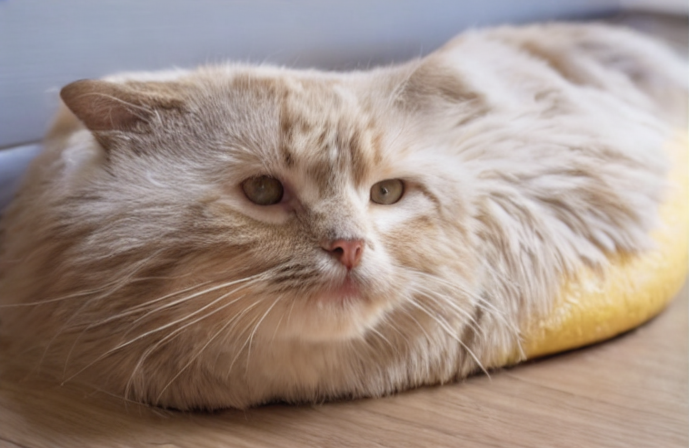
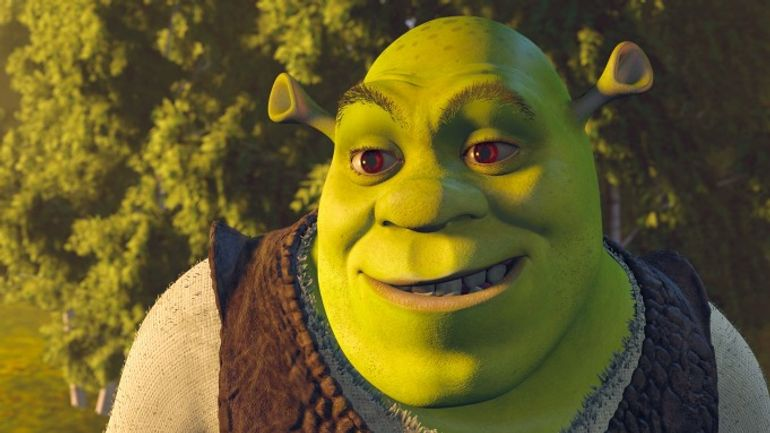
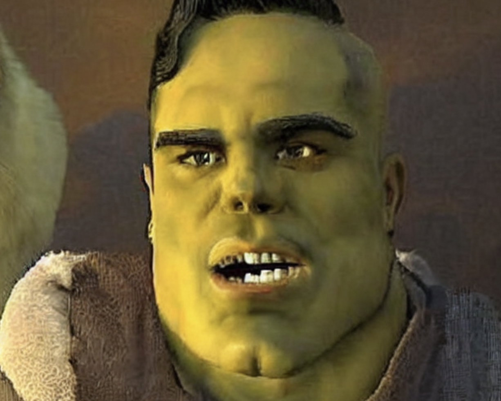
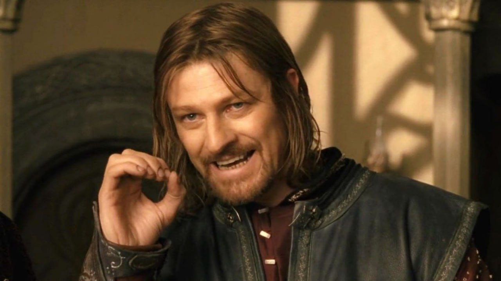
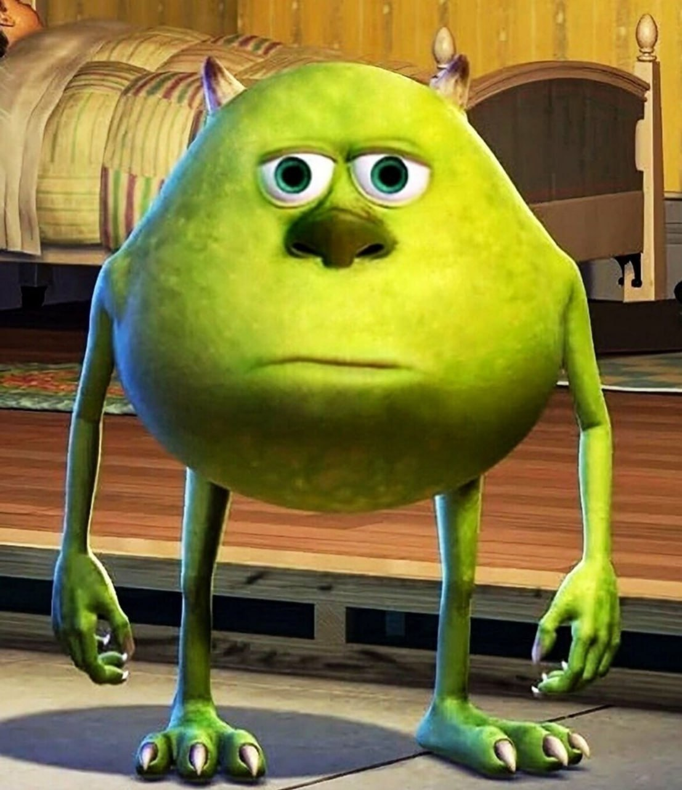
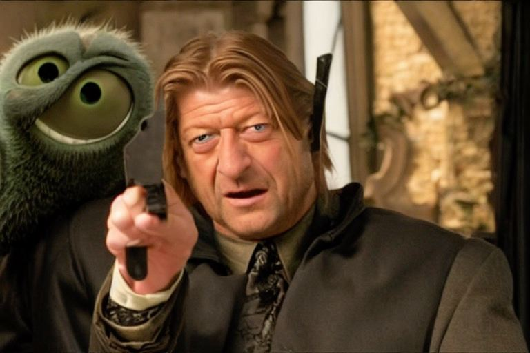

# Image Blending Project

The Image Blending Project is a deep learning application that combines two images in a unique way. The program generates a "caption" for the first image using an Image Captioning model. This caption is then used as a prompt to generate a new image based on the second input image using a Stable Diffusion pipeline.

## Technique

We utilize state-of-the-art techniques in image processing and natural language processing to achieve our goal. The first part of the process involves generating a caption for the first image. This is accomplished with the help of the Vision Encoder Decoder Model, which takes an image as input and produces a descriptive sentence.

The generated sentence is then fed into a Stable Diffusion pipeline along with the second image. The Stable Diffusion pipeline utilizes a technique for latent encoding of the images. It generates the new image by blending the latent space of the second image with the semantic context provided by the caption of the first image. This results in a new image that has characteristics of both the second image and the first image's caption.

## Getting Started

### Requirements

- Python 3.6 or above
- PyTorch
- Transformers
- Tqdm
- PIL
- Diffusers

### Installation

To install the necessary packages, run the following command:

```bash
pip install -r requirements.txt
```

### Running the Code
After cloning the repository and navigating into the project's root directory, you can run the program with the following command:

```bash
python src/run.py <path_to_first_image> <path_to_second_image>
```
Replace <path_to_first_image> and <path_to_second_image> with the paths to your images.

For example:

```bash
python src/run.py images/image1.jpg images/image2.jpg
```
This command will generate a new image and save it as generated_image.png in the project's root directory.

## Results

This section demonstrates the effectiveness of our image blending project. Below, you can find a few examples of images generated by our application. The first image was the initial input, the second image served as a basis for the generated image, and the generated image is the final output.

| Initial Input | Second Image | Generated Output |
|:-------------:|:------------:|:----------------:|
|  |  |  |
|  |  |  |
|  |  |  |

As you can see, the generated images bear a clear resemblance to the second image, while also incorporating elements described by the captions generated from the initial inputs. This demonstrates the potential of our application to combine different images in a meaningful and creative way.

## Future Enhancements

While the current solution demonstrates promising results, we believe that there is still room for further enhancements. In particular, we identify the following potential improvements that could be pursued given more resources:

1. **Training a Larger Model**: Our current implementation utilizes pre-trained models. While these models have been trained on large and diverse datasets, training a larger model specific to our task could potentially improve the performance and the quality of the generated images.

2. **Fine-tuning the Model**: With additional resources, we could fine-tune the model on a dataset that is more relevant to our specific use case. This could involve using a dataset with images and captions that closely resemble the types of inputs our application will typically handle.

3. **Improving the Blending Algorithm**: As we gather more user feedback and real-world usage data, we could refine and improve our image blending algorithm. This could involve making it more adaptable to a wider variety of image styles and themes.


